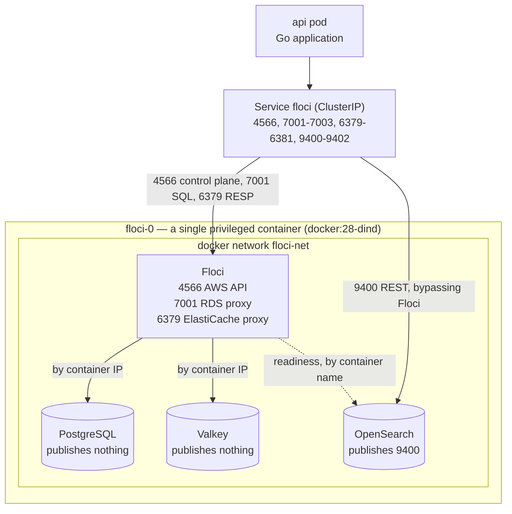

# app-with-floci

A sample application that uses [Floci](https://github.com/floci-io/floci) to
stand in for three AWS services — **RDS**, **ElastiCache** and **OpenSearch** —
running on [Okteto](https://okteto.com).

**Floci Flix** is a small movie catalogue. Each service does the job it actually
exists for:

| Service | Backed by | Used for |
|---|---|---|
| RDS | PostgreSQL 16 | The authoritative `movies` table. Writes are transactional. |
| OpenSearch | OpenSearch 2.11 | Full-text and fuzzy search, with genre facets. |
| ElastiCache | Valkey 8 | Cache-aside on the detail read path, plus a sorted set of view counts. |

The UI has a fourth page, **Emulator**, showing what each AWS control-plane call
returned and where the app actually connected. If you only look at one page,
look at that one.

---

## What to know before deploying

Floci implements these three services by starting **real engine containers**
through a Docker daemon. It is not mocking them.

That works on a laptop, where Floci uses the host's Docker socket. Kubernetes has
no socket to share, so in a cluster Floci has to bring its own daemon — which
means a **privileged Docker-in-Docker pod**.

---

## How it is deployed

Floci runs as a container **inside** the Docker daemon, not as a sibling
Kubernetes container. That is forced: Floci resolves the OpenSearch node by
Docker container name, and only a container attached to that network can use
Docker's embedded resolver.



**Why one Service reaches all of it.** `dockerd` runs inside the pod, so the
ports it publishes are bound in the pod's own network namespace and land on the
pod IP. A plain ClusterIP Service therefore reaches both Floci's own listeners
*and* the port the OpenSearch container publishes — even though nothing in the
pod spec declares 9400.

**Two ways a service is exposed**, and the difference is the thing to remember:

| | Listener on the pod | Traffic path |
|---|---|---|
| RDS `floci:7001` | Floci's own TCP proxy | app → **Floci** → PostgreSQL |
| ElastiCache `floci:6379` | Floci's own TCP proxy | app → **Floci** → Valkey |
| OpenSearch `floci:9400` | the OpenSearch container | app → **OpenSearch**, Floci uninvolved |

PostgreSQL and Valkey publish no ports at all, so they are reachable only
*through* Floci, which is also where SigV4 and IAM auth are enforced. OpenSearch
publishes its own port, so it is reachable *around* Floci — which is why the
`floci:9400` address looks like it goes to Floci and does not.

---

## Deploy it

```bash
okteto context use <your-context>
okteto namespace use <your-namespace>
okteto deploy
```

That applies `k8s/floci.yaml`, then hands `docker-compose.yml` to Okteto, which
turns it into the api and web Deployments and Services. `okteto endpoints` prints
the public URL.

The first deploy is slow: the Floci pod pulls ~2.3 GB of engine images into its
PVC before it will answer. Later deploys reuse that cache.

For a hot-reload loop on either service:

```bash
okteto up api     # go run, rebuilt on save
okteto up web     # vite dev server
```

### Configuration

Everything is set in `docker-compose.yml` as environment variables with
defaults, so a plain `okteto deploy` works with no arguments. Any of them can be
overridden by an **Okteto admin variable**, or per deploy:

```bash
okteto deploy --var APP_DB_PASSWORD=... --var SEARCH_DOMAIN=...
```

| Variable | Default | What it does |
|---|---|---|
| `APP_DB_USER` | `appuser` | Master user for the RDS instance the app creates |
| `APP_DB_PASSWORD` | a placeholder | Master password. See the note below |
| `APP_DB_NAME` | `flociflix` | Database name |
| `FLOCI_ENDPOINT` | `http://floci:4566` | Where the AWS control plane lives |
| `AWS_REGION` | `us-east-1` | Region reported by Floci |
| `DB_INSTANCE_ID` | `flociflix-db` | RDS instance the app creates and looks up |
| `CACHE_GROUP_ID` | `flociflix-cache` | ElastiCache replication group |
| `SEARCH_DOMAIN` | `flociflix-search` | OpenSearch domain |
| `OPENSEARCH_ENDPOINT_OVERRIDE` | unset | Forces a specific address. Normally unnecessary — see below |

Floci's own settings (`FLOCI_*`: hostnames, proxy port ranges, storage mode) live
in `k8s/floci.yaml`, because that is the manifest that runs it.

> These values are ordinary environment variables and end up in the pod spec as
> plaintext, readable by anyone with namespace read access. That is acceptable
> for an in-memory emulator database that is recreated on every restart and is
> never reachable from outside the namespace — but do not point them at anything
> real.

---

## How a request flows

The API has no public endpoint. Only `web` does, and nginx proxies to the API
server-side inside the cluster:

```
browser -> https://web-<ns>.<cluster>/api/movies     public endpoint, web pod
             nginx: location /api/ -> proxy_pass http://api:8080
               ClusterIP Service "api", private to the namespace
                 api -> floci:7001  PostgreSQL  (through Floci's proxy)
                 api -> floci:6379  Valkey      (through Floci's proxy)
                 api -> floci:9400  OpenSearch  (direct, published port)
```

The frontend only ever issues relative URLs, so the browser sees a single origin
and there is no CORS involved. Under `okteto up web`, Vite's dev proxy takes
nginx's place.

In compose terms: `api` declares a bare `"8080"`, which stays on the cluster's
private network, while `web` declares `"8080:8080"` — the mapping is what makes
Okteto publish an endpoint.

---

## How the app finds its dependencies

At startup the API calls Floci's control plane with the ordinary AWS SDK —
`DescribeDBInstances`, `DescribeReplicationGroups`, `DescribeDomain` — and uses
the endpoints it gets back. That is the point of running an emulator: the SDK
path is real.

```
DescribeDBInstances        -> floci:7001   ->  PostgreSQL  (proxied by Floci)
DescribeReplicationGroups  -> floci:6379   ->  Valkey      (proxied by Floci)
DescribeDomain             -> floci:9400   ->  OpenSearch  (direct, see below)
```

`FLOCI_HOSTNAME=floci` is what makes the first two resolve: Floci advertises
itself by that name, and it matches the Kubernetes Service name.

The API also **creates** those three resources if they are missing, through the
same SDK, then applies `internal/store/schema.sql`, loads
`internal/store/seed.sql` when the table is empty, and rebuilds the OpenSearch
index from whatever PostgreSQL holds. OpenSearch is never seeded directly, so one
path covers both a first run and a restart that replaced the search node while
leaving the database intact.

### The one wrinkle

Floci advertises the OpenSearch endpoint as a **Docker container name**,
`http://floci-opensearch-<domain>:9200`, and ignores `FLOCI_HOSTNAME` when doing
so. That name resolves only from inside Floci's Docker network — true for a
container on that network, false for a Kubernetes pod.

So the API checks whether the name resolves. If it does, it uses it. If it does
not, it falls back to the Floci Service on port 9400, where the OpenSearch
container publishes. Nothing to configure per environment;
`OPENSEARCH_ENDPOINT_OVERRIDE` exists only to force a specific address.

The Emulator page shows the advertised value, the effective one, and which rule
was applied.

---

## Ports

| Port | Bound by | Carries |
|---|---|---|
| 4566 | Floci | Every AWS API call |
| 7001–7003 | Floci proxy | PostgreSQL wire protocol + IAM auth |
| 6379–6381 | Floci proxy | Valkey RESP + IAM auth |
| 9400–9402 | OpenSearch container | OpenSearch REST, direct |

Kubernetes Services cannot express port ranges, so the ranges are narrowed to
three ports each via `FLOCI_SERVICES_*_PROXY_*_PORT` and enumerated in the
Service. Both live in `k8s/floci.yaml` — widen them together.

Two ranges must **not** be published: `5100–5199` (Floci starts an ECR registry
sidecar that binds them itself) and `9200–9299` (Lambda Runtime API, internal).

---

## What a restart does

Floci runs with `FLOCI_STORAGE_MODE=memory`, so a restart of the Floci pod is a
clean slate: new engine containers, no data. The API notices, re-creates the
three AWS resources, re-applies the schema, re-seeds the catalogue and rebuilds
the search index. No manual step, and the environment comes back working.

**Data does not survive a restart.** Treat anything you add through the UI as
disposable. Okteto namespaces scale to zero, so this happens routinely rather
than exceptionally.

That is a deliberate choice, and it is worth understanding why, because it is a
property of Floci rather than of this app. With a persistent storage mode Floci
restores its *resource metadata* across a restart but does not re-create all of
the engine *containers* to match. The control plane then reports a service as
`available` while nothing is listening behind it, which is a much worse failure
than an empty database: it looks healthy and hangs. Memory mode trades
durability for a restart that is deterministic.

Two consequences shape the app:

- The API **supervises** its connections rather than connecting once. Floci
  replaces engines behind the *same* addresses, so an open socket proves nothing
  — every 10 seconds it checks that its schema and search index still exist.
- The PVC still matters even without durable data: it caches the ~2.3 GB of
  engine images, which is the expensive part of a cold start.

---

## API

| Route | Exercises | Notes |
|---|---|---|
| `GET /api/movies?q=&genre=&from=&size=` | OpenSearch | Fuzzy multi-field query, genre facets, paged |
| `GET /api/movies/{id}` | Valkey → PostgreSQL | Cache-aside; returns `X-Cache: HIT\|MISS` and the lookup time |
| `POST /api/movies` | all three | PostgreSQL tx → index → invalidate |
| `GET /api/trending` | Valkey | `ZINCRBY` view counters |
| `GET /api/aws/status` | Floci control plane | Advertised vs effective endpoints |
| `GET /api/health`, `/api/ready` | — | Health answers immediately; ready waits for all three |

## Layout

```
docker-compose.yml   The application. Okteto turns this into Deployments and
                     Services directly — no manifests, no ConfigMaps.
okteto.yaml          Applies the Floci manifest, then the compose file. Plus a
                     dev section for hot reload.
k8s/floci.yaml       The one Kubernetes manifest: StatefulSet + Service for
                     privileged Docker-in-Docker, and Floci's own settings.
api/                 Go: provisioning, discovery, the three data paths, the
                     inspector endpoint. internal/store/schema.sql is the DDL,
                     internal/store/seed.sql the starter catalogue (150 movies).
web/                 React + Vite + TypeScript: search, detail, add, emulator
```

Compose cannot express `privileged`, which Docker-in-Docker requires, so Floci
comes from a manifest. Everything else comes from compose.
